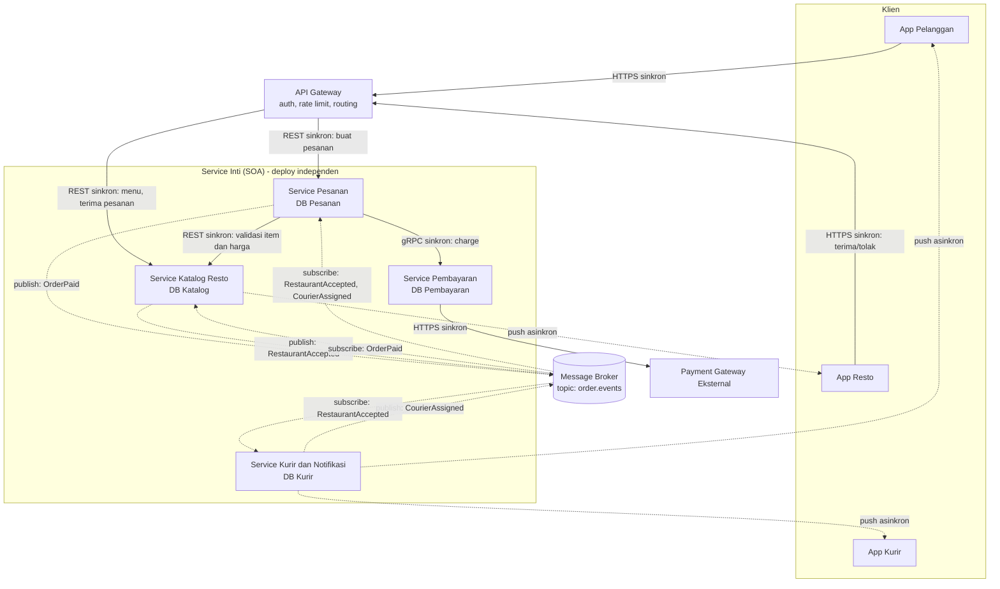

# Tugas 2 – Perancangan Arsitektur Decoupled FoodGo

**Kelompok:** [kelompok 5]

| Nama | NIM | Kontribusi |
|---|---|---|
| Hendra DIrga Dwi Saputra | 103072430018 | Menentukan gaya arsitektur, yaitu kombinasi SOA dan Pub-Sub, beserta alasan pemilihannya dibanding SOA sinkron saja atau Pub-Sub saja |
| Alif Luthfan Adeefa | 103072400163 | Merancang komponen Pesanan, Pembayaran, Katalog Resto, Kurir/Notifikasi, API Gateway, dan Message Broker beserta interaksinya. Menyusun alur pesanan dari dibuat sampai kurir ditugaskan, dan menandai tiap komunikasi sebagai sinkron atau asinkron. |
| Setyo Nugroho | 103072400045 | Menganalisis bagaimana rancangan ini mengurangi coupling dari Tugas 1, yaitu deploy bersamaan dan pemanggilan tanpa timeout. Menyusun kekurangan yang muncul, seperti debugging yang lebih sulit dan data yang tidak selalu konsisten seketika, beserta cara menanganinya. |
---

## 1. Ringkasan Keputusan

| Aspek | Keputusan |
|---|---|
| Gaya arsitektur | **Hybrid: SOA untuk service inti + Publish-Subscribe untuk alur pasca-pembayaran** |
| Komponen | API Gateway, Service Pesanan, Service Pembayaran, Service Katalog Resto, Service Kurir & Notifikasi, Message Broker |
| Komunikasi sinkron | Checkout: validasi menu/harga dan pembayaran |
| Komunikasi asinkron | Notifikasi resto, penugasan kurir, update status |
| Prinsip data | Setiap service memiliki database sendiri (*database per service*) |

Monolit FoodGo gagal karena, semua modul dalam satu proses dan satu deploy, pemanggilan antar modul tanpa timeout/retry (asumsi "network is always reliable"), dan tidak ada isolasi kegagalan. Rancangan ini menargetkan ketiganya, dengan tujuan tim kurir dan tim resto bisa deploy tanpa saling mengganggu.

---

## 2. Pemilihan Gaya Arsitektur & Justifikasi

Kami memilih kombinasi SOA dan Publish-Subscribe. Modul pesanan, pembayaran, katalog resto, dan kurir/notifikasi dipisah menjadi service sendiri dengan API yang jelas, sehingga masing-masing bisa di-deploy tanpa me-restart yang lain. Ini menjawab masalah utama di monolit FoodGo, yaitu satu kali deploy membuat semua modul ikut restart.

Pola komunikasinya tidak kami samakan. Validasi harga dan pembayaran memakai komunikasi sinkron karena pelanggan menunggu hasilnya dan pesanan baru boleh lanjut kalau pembayaran berhasil. Setelah pembayaran, yaitu saat memberi tahu resto dan mencari kurir, kami memakai Pub-Sub. Service Pesanan cukup mengirim event `OrderPaid` ke broker tanpa perlu tahu siapa yang akan memprosesnya, dan pelanggan tidak perlu menunggu sampai kurir ditemukan.

Kami tidak memakai SOA sinkron sepenuhnya karena alurnya akan menjadi rantai panggilan dari Pesanan ke Pembayaran, Notifikasi, lalu Kurir. Kalau service kurir lambat, pesanan ikut lambat. Itu sama saja dengan masalah di Tugas 1, hanya pindah dari dalam satu proses ke jaringan. Kami juga tidak memakai Pub-Sub sepenuhnya karena pembayaran butuh jawaban langsung, dan alur yang serba event jauh lebih sulit dilacak saat terjadi error.

Kombinasi ini juga menjawab asumsi keliru dari Tugas 1. Semua panggilan sinkron diberi timeout, retry terbatas, dan circuit breaker, jadi tidak ada lagi menunggu tanpa batas. Panggilan sinkron di jalur checkout hanya dua (ke Katalog dan ke Pembayaran), sehingga pengaruh latensi jaringan lebih kecil. Broker menyimpan event sampai berhasil diproses, jadi event tidak hilang kalau ada service yang sedang down. Setiap service juga bisa diperbanyak sendiri, misalnya Katalog Resto saat jam makan siang.

---

## 3. Diagram Arsitektur

> garissolid = komunikasi sinkron (request response), garis putus putus = komunikasi asinkron (event/push).

### Tabel jenis komunikasi

| No | Dari → Ke | Sinkron / Asinkron | Pola | Alasan |
|---|---|---|---|---|
| 1 | Pelanggan → Gateway → Pesanan | Sinkron | Request-response (REST) | Pelanggan butuh konfirmasi langsung |
| 2 | Pesanan → Katalog | Sinkron | Request-response (REST) | Harga/ketersediaan harus valid sebelum bayar |
| 3 | Pesanan → Pembayaran | Sinkron | Request-response (gRPC) | Hasil bayar menentukan kelanjutan pesanan |
| 4 | Pembayaran → Payment Gateway | Sinkron | Request-response (HTTPS) | Integrasi eksternal |
| 5 | Pesanan → Broker | Asinkron | Event `OrderPaid` (publish) | Pesanan tidak perlu tahu siapa yang bereaksi |
| 6 | Broker → Katalog Resto | Asinkron | Event (subscribe) | Resto diberi tahu tanpa memblokir checkout |
| 7 | Katalog Resto → App Resto | Asinkron | Push notification | Resto tidak perlu polling |
| 8 | Resto → Katalog (via Gateway) | Sinkron | Request-response | Aksi terima/tolak harus langsung terkonfirmasi |
| 9 | Katalog → Broker → Kurir/Notif & Pesanan | Asinkron | Event `RestaurantAccepted` | Beberapa konsumen, satu peristiwa |
| 10 | Kurir/Notif → Broker → Pesanan | Asinkron | Event `CourierAssigned` | Pesanan memperbarui status tanpa dipanggil langsung |
| 11 | Kurir/Notif → App Kurir & Pelanggan | Asinkron | Push notification | Pemberitahuan tanpa polling |

---

## 5. Analisis Trade-off

Arsitektur ini tidak membuat masalah hilang begitu saja, sebagian hanya berpindah tempat. Berikut kekurangan dan kompleksitas baru yang muncul beserta cara menanganinya.

1. **Beban operasional bertambah** Dulu FoodGo cukup mengurus satu aplikasi dan satu database. Sekarang ada API gateway, message broker, empat
service, dan empat database yang harus di-deploy dan dipantau. Untuk tim kecil ini beban yang nyata. Kalau tim belum siap, opsi yang lebih aman
adalah memulai dari monolit yang dipisah per modul, lalu memecahnya bertahap, dimulai dari modul kurir/notifikasi.

2. **Alur lebih sulit dilacak.** Di monolit, error bisa dicari lewat satu log. Sekarang satu pesanan melewati beberapa service dan event, dan
urutannya tidak selalu lurus. Solusinya, setiap log dan event membawa ID yang sama (misalnya `orderId`) dan semua log dikumpulkan di satu tempat.

3. **Data tidak selalu konsisten seketika.** Karena tiap service punya database sendiri, tidak ada satu transaksi yang mencakup semuanya. Status
di aplikasi pelanggan bisa tertinggal beberapa detik, dan bisa terjadi pembayaran sudah berhasil tetapi resto menolak pesanan. Kasus ini ditangani
dengan pembatalan otomatis dan refund, begitu juga kalau resto tidak merespons dalam batas waktu.

4. **Event bisa hilang atau terkirim ganda.** Kalau Service Pesanan sudah menyimpan status `PAID` tetapi gagal mengirim event ke broker, resto
tidak akan tahu ada pesanan. Solusinya, event ditulis ke database bersamaan dengan status pesanan, lalu dikirim ke broker secara terpisah (pola *outbox*). Sebaliknya, broker bisa mengirim event yang sama dua kali, jadi service penerima harus bisa menangani event ganda, misalnya agar tidak menugaskan dua kurir untuk satu pesanan.

5. **Ketergantungan sinkron belum hilang.** Saat checkout, Service Pesanan tetap menunggu Katalog dan Pembayaran. Timeout dan circuit breaker hanya membatasi dampaknya. Kalau payment gateway lambat, pelanggan tetap harus menunggu sebentar atau melihat status "pembayaran sedang diproses".

6. **Broker dan API gateway berdampak besar kalau mati.** Keduanya dilewati hampir semua alur, sehingga perlu dijalankan dalam bentuk cluster.

7. **Laporan lintas service lebih rumit.** Data pesanan, pembayaran, dan kurir ada di database berbeda, sehingga tidak bisa digabung dengan satu query `JOIN`. Perlu tabel laporan terpisah yang diisi dari event.

---

## 6. Kesimpulan

Kombinasi **SOA + Pub-Sub** dipilih karena kebutuhan FoodGo bersifat campuran. Bagian yang butuh jawaban langsung (validasi dan pembayaran) memakai komunikasi sinkron yang dilindungi timeout dan circuit breaker. Bagian yang berupa reaksi berantai (notifikasi resto, penugasan kurir) memakai event asinkron agar tidak memblokir pelanggan dan tidak saling menjatuhkan. Hasilnya, deploy per modul, *scaling* selektif, dan isolasi kegagalan tercapai. Harganya adalah kompleksitas operasional, konsistensi eventual, dan debugging yang lebih sulit, yang perlu diimbangi dengan tracing, outbox, idempotency, dan kontrak yang di-versi.
